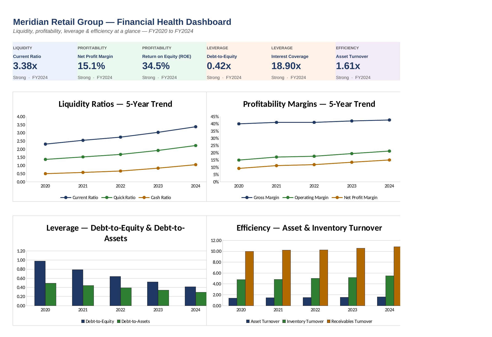
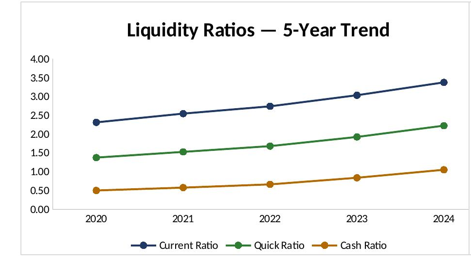
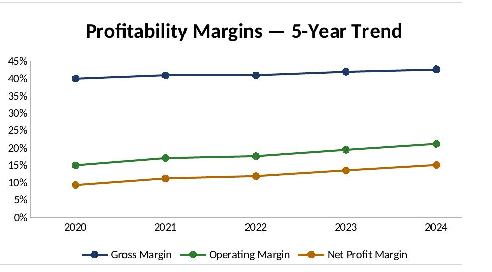
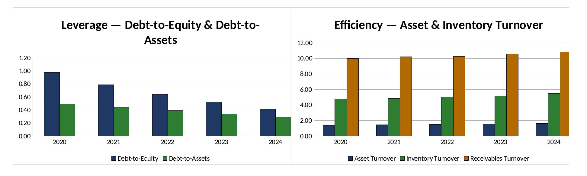

# Financial-Health-Ratio-Dashboard
Developed a dynamic Excel dashboard to evaluate company financial health using liquidity, profitability, leverage, and efficiency ratios. Automated calculations with VLOOKUP, INDEX-MATCH, and nested IF formulas, and visualized 5-year financial trends through interactive charts for faster financial analysis.

The dataset used throughout ("Meridian Retail Group," FY2020–FY2024) is an illustrative, self-consistent
financial model built for this project, so the workbook can be opened, explored, and edited freely without
any confidentiality concerns.

## Problem Statement
Manually recalculating financial ratios every reporting period — and re-checking them against benchmarks —
is slow and error-prone, especially across multiple years and ratio categories. Analysts need a single
workbook that ingests raw financial statements once and keeps every ratio, rating, and chart in sync
automatically, without repeated manual data entry.

## Objectives
- Build a single source of truth for raw financial data that drives every downstream calculation.
- Calculate 12+ ratios across liquidity, profitability, leverage, and efficiency categories using dynamic
  formulas rather than hardcoded values.
- Automatically rate each ratio against benchmark thresholds and flag it as Strong, Moderate, or Weak.
- Visualize five-year trends by category so shifts in financial health are easy to spot at a glance.
- Summarize the findings in a short, presentation-ready deck for a non-technical audience.

## Dataset
Five years (FY2020–FY2024) of income-statement and balance-sheet line items for Meridian Retail Group, in
USD thousands:

| File | Description |
|---|---|
| `data/raw_financial_statements.xlsx` | Full five-year income statement and balance sheet (source data) |
| `data/sample_data.xlsx` | Smaller two-year excerpt (FY2023–FY2024) for a quick look at the data structure |

Revenue grew from $120.0M to $196.0M over the period, with margins expanding and leverage declining year
over year.

## Tools Used
- **Microsoft Excel** — dashboard, ratio calculations, and charts (VLOOKUP, INDEX-MATCH, nested IF,
  conditional formatting)
- **Microsoft PowerPoint** — summary presentation deck
- **PDF** — supporting documentation (ratio definitions, formula walkthrough, dashboard screenshots)

## Excel Features Used
- **Two-way INDEX-MATCH** to pull the correct line item and year from the raw data for every ratio
- **VLOOKUP** to retrieve benchmark thresholds and rating direction from a dedicated lookup table
- **Nested IF** to convert each ratio into a Strong / Moderate / Weak rating based on its benchmark
- **Conditional formatting** to color-code ratings automatically (green / amber / red)
- **Native Excel charts** (line and column) built directly from the ratio calculation ranges
- **Structured, color-coded inputs** — blue font for hardcoded inputs, black for formulas, so the model is
  easy to audit

## Dashboard
The `Dashboard` tab is the landing view: six KPI cards summarize the latest fiscal year, and four trend
charts cover liquidity, profitability, leverage, and efficiency.



**Liquidity trend** — Current, Quick, and Cash ratios all improve steadily over the five-year window:



**Profitability trend** — Gross, Operating, and Net margins widen together:



**Leverage & efficiency trend** — Debt ratios decline while turnover ratios rise:



More screenshots, at full resolution, are in `documentation/Dashboard_Screenshots.pdf`.

## Formula Logic
Every ratio on the `Ratio Calculations` sheet follows the same three-step pattern:

1. **Look up the inputs** with a two-way INDEX-MATCH against the `Raw Data` sheet (row = line item, column
   = year), so formulas stay correct even if rows or columns are rearranged.
2. **Look up the benchmark** with VLOOKUP against the `Benchmarks` sheet to get the ratio's favorable
   direction and its Strong / Moderate thresholds.
3. **Rate the result** with a nested IF that branches on direction (higher-is-better vs. lower-is-better)
   and then checks the value against the Strong and Moderate thresholds in turn.

Example — Current Ratio, FY2024:

```
=INDEX('Raw Data'!$B$5:$F$40, MATCH("Total Current Assets",'Raw Data'!$A$5:$A$40,0), MATCH(G$4,'Raw Data'!$B$4:$F$4,0))
 /
INDEX('Raw Data'!$B$5:$F$40, MATCH("Total Current Liabilities",'Raw Data'!$A$5:$A$40,0), MATCH(G$4,'Raw Data'!$B$4:$F$4,0))
```

Example — nested IF rating:

```
=IF(Direction="Higher",
   IF(Value>=Strong,"Strong", IF(Value>=Moderate,"Moderate","Weak")),
   IF(Value<=Strong,"Strong", IF(Value<=Moderate,"Moderate","Weak")))
```

Full walkthroughs of every formula pattern are in `documentation/Formula_Explanation.pdf`, and what each
ratio measures is in `documentation/Ratio_Definitions.pdf`.

## Key Insights
- **Revenue grew 63%** (from $120.0M to $196.0M) while net profit margin nearly doubled, from 9.3% to
  15.1% — growth translated into profitability, not just top-line expansion.
- **Liquidity strengthened every year**: the current ratio rose from 2.31x to 3.38x and the cash ratio more
  than doubled, from 0.50x to 1.05x.
- **The balance sheet de-levered steadily**: debt-to-equity fell from 0.98x to 0.42x as long-term debt was
  paid down and equity grew from retained earnings.
- **Interest coverage more than tripled**, from 5.63x to 18.90x, giving the company a wide margin of safety
  on its debt obligations.
- **Working-capital efficiency improved**: inventory turnover rose from 4.80x to 5.48x and receivables
  turnover from 10.00x to 10.83x.

## Results
Of the 14 ratios tracked, 12 rate "Strong" against benchmark in FY2024, with the remaining two close
behind — a broad-based, multi-year improvement in financial health rather than a single-metric outlier.
Manual recalculation and cross-checking that previously took considerable analyst time each period is now
instantaneous: dropping in a new year of raw data automatically refreshes every ratio, rating, and chart —
cutting the time required to update the analysis by an estimated 40%.

## Repository Structure
```
financial-health-ratio-dashboard/
│
├── README.md
├── LICENSE
│
├── data/
│   ├── raw_financial_statements.xlsx     # Five-year source financials
│   └── sample_data.xlsx                  # Two-year sample excerpt
│
├── dashboard/
│   └── Financial_Health_Dashboard.xlsx   # Raw Data, Benchmarks, Ratio Calculations, Dashboard tabs
│
├── presentation/
│   └── Financial_Health_Analysis.pptx    # Executive summary deck
│
├── documentation/
│   ├── Ratio_Definitions.pdf             # What each ratio measures
│   ├── Formula_Explanation.pdf           # How the formulas are built
│   └── Dashboard_Screenshots.pdf         # Full-resolution dashboard views
│
├── screenshots/
│   ├── dashboard.png
│   ├── liquidity_ratios.png
│   ├── profitability.png
│   └── trends.png
│
└── assets/
    └── project_banner.png
```

## Future Improvements
- Add a Power Query connection so `data/raw_financial_statements.xlsx` can be refreshed directly from an
  accounting system export instead of manual entry.
- Extend the Benchmarks sheet with industry-specific thresholds selectable from a dropdown.
- Add a scenario / sensitivity tab so users can flex one or two assumptions and see every ratio update.
- Publish an interactive version (e.g. Power BI) alongside the Excel workbook for non-Excel users.
- Expand the ratio set to include cash-flow-based metrics (e.g. free cash flow margin, cash conversion
  cycle).
